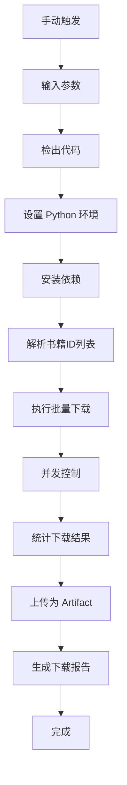

# ☁️ GitHub Actions 云端下载指南

**无需安装任何软件，直接在 GitHub 云端批量下载小说！**

## 📋 概述

GitHub Actions 云端下载功能允许您无需本地安装 Python 环境，直接在 GitHub 的服务器上批量下载番茄小说。这是最简单、最快捷的使用方式。

## 🚀 快速开始（3步）

### 第1步：进入 Actions 页面

1. 打开 [番茄小说下载器仓库](https://github.com/POf-L/Fanqie-novel-Downloader)
2. 点击顶部的 **Actions** 标签
3. 选择左侧的 **Download Novels** 工作流

### 第2步：触发下载

1. 点击 **Run workflow** 按钮
2. 填写下载参数：
   ```
   书籍ID列表: 7372503659137005093, 7372528691033300280
   输出格式: txt 或 epub
   保存路径: downloads
   并发数量: 3
   ```
3. 点击绿色的 **Run workflow** 开始下载

### 第3步：下载文件

1. 等待执行完成（通常 5-15 分钟）
2. 进入运行详情页面
3. 在页面底部的 **Artifacts** 区域下载压缩包

## 📝 参数说明

| 参数 | 说明 | 示例 | 必填 |
| :--- | :--- | :--- | :--- |
| **书籍ID列表** | 要下载的书籍ID（逗号或空格分隔） | `7372503659137005093, 7372528691033300280` | ✅ |
| **输出格式** | `txt` 或 `epub` | `txt` | ✅ |
| **保存路径** | 下载文件保存位置（可选） | `downloads` | ❌ |
| **并发数量** | 同时下载的书籍数（1-5，可选） | `3` | ❌ |

## 🔍 如何获取书籍ID

### 方法1：从网页URL获取

```
URL: https://fanqienovel.com/page/7372503659137005093
书籍ID: 7372503659137005093
```

### 方法2：使用搜索功能

如果您有本地环境，可以使用搜索功能：

```bash
python core/cli.py search "斗破苍穹"
```

### 方法3：从番茄小说APP获取

1. 在番茄小说APP中打开书籍详情页
2. 查看URL或分享链接
3. 提取其中的数字ID

## 💡 使用示例

### 示例 1：下载单本小说（TXT格式）

**场景**：快速下载一本小说到本地

```
书籍ID列表: 7372503659137005093
输出格式: txt
保存路径: downloads
并发数量: 1
```

**预期结果**：
- 下载时间：约 5-10 分钟
- 文件大小：约 5-10MB
- 文件位置：`downloads/7372503659137005093/`

### 示例 2：批量下载多本小说（EPUB格式）

**场景**：下载一个系列的多本小说

```
书籍ID列表: 7372503659137005093, 7372528691033300280, 7123456789012345678
输出格式: epub
保存路径: novels/fantasy
并发数量: 3
```

**预期结果**：
- 下载时间：约 15-30 分钟
- 文件大小：约 15-30MB
- 文件位置：`novels/fantasy/`
- 包含封面图片

### 示例 3：大批量下载（高并发）

**场景**：批量下载大量小说

```
书籍ID列表: 7372503659137005093, 7372528691033300280, 7123456789012345678, 7234567890123456789, 7345678901234567890
输出格式: txt
保存路径: downloads/batch-2024
并发数量: 5
```

**预期结果**：
- 下载时间：约 30-60 分钟
- 文件大小：约 25-50MB
- 文件位置：`downloads/batch-2024/`
- **注意**：单次建议不超过 20 本

### 示例 4：按类型分类下载

**场景**：按小说类型组织下载

```
书籍ID列表: 7372503659137005093, 7372528691033300280
输出格式: epub
保存路径: novels/xianxia
并发数量: 2
```

**预期结果**：
- 下载时间：约 10-20 分钟
- 文件位置：`novels/xianxia/`
- 便于分类管理

### 示例 5：定时自动下载

**场景**：每天自动下载更新

修改 `.github/workflows/download-novels.yml`：

```yaml
on:
  workflow_dispatch:
    # ... 现有配置
  schedule:
    - cron: '0 2 * * *'  # 每天凌晨2点执行
```

**预期结果**：
- 每天自动执行下载
- 无需手动操作
- 适合追更用户

### 示例 6：自动提交到仓库

**场景**：将下载的小说保存到 GitHub 仓库

在工作流中添加：

```yaml
- name: 提交下载的文件
  run: |
    git config user.name "GitHub Actions"
    git config user.email "actions@github.com"
    git add downloads/
    git commit -m "Auto download novels"
    git push
```

**预期结果**：
- 下载的文件自动提交到仓库
- 随时可以从仓库访问
- **注意**：注意仓库大小限制

## 📊 下载报告

每次下载完成后，会在 Actions 运行页面的 **Summary** 标签中生成详细报告，包含：

### 下载配置
- 📖 书籍数量
- 📄 输出格式
- 🔢 并发数
- 📁 保存路径

### 下载结果
- ✅ 成功文件数量
- 💾 总文件大小
- 📦 Artifact 名称

### 下载指引
- 📥 如何获取下载的文件
- ⏰ Artifact 保留时间

## ⚙️ 高级功能

### 定时下载

您可以修改 `.github/workflows/download-novels.yml` 添加定时触发：

```yaml
on:
  workflow_dispatch:
    # ... 现有配置
  schedule:
    - cron: '0 2 * * *'  # 每天凌晨2点执行
    - cron: '0 12 * * *'  # 每天中午12点执行
```

**Cron 表达式说明**：
- `0 2 * * *`：每天凌晨 2 点
- `0 */6 * * *`：每 6 小时执行一次
- `0 0 * * 0`：每周日凌晨执行

### 自动提交到仓库

添加自动提交步骤，将下载的文件保存到仓库：

```yaml
- name: 提交下载的文件
  run: |
    git config user.name "GitHub Actions"
    git config user.email "actions@github.com"
    git add downloads/
    git commit -m "Auto download novels"
    git push
```

**注意事项**：
- 确保仓库有足够的存储空间
- 注意 GitHub 仓库大小限制（1GB 免费）
- 大文件建议使用 Git LFS

### 自定义下载脚本

您可以创建自己的下载脚本，然后通过 Actions 执行：

```bash
# 创建自定义脚本
echo "python core/cli.py batch-download BOOK_IDS --format epub" > download.sh

# 在 Actions 中执行
- name: 执行自定义下载
  run: |
    chmod +x download.sh
    ./download.sh
```

### 使用环境变量

在工作流中使用环境变量：

```yaml
env:
  BOOK_IDS: "7372503659137005093,7372528691033300280"
  FORMAT: "epub"
  CONCURRENT: "3"

steps:
  - name: 执行下载
    run: |
      python core/cli.py batch-download $BOOK_IDS --format $FORMAT --concurrent $CONCURRENT
```

### 使用矩阵策略

并行下载多个批次：

```yaml
strategy:
  matrix:
    batch:
      - "7372503659137005093,7372528691033300280"
      - "7123456789012345678,7234567890123456789"

steps:
  - name: 批量下载
    run: |
      python core/cli.py batch-download ${{ matrix.batch }} --format epub
```

### 下载后处理

在下载完成后进行额外处理：

```yaml
- name: 下载后处理
  run: |
    # 重命名文件
    mv downloads/7372503659137005093.txt "downloads/斗破苍穹.txt"
    
    # 压缩文件
    zip -r novels.zip downloads/
    
    # 生成目录
    ls downloads/ > downloads/目录.txt
```

## 🔧 工作流程详解



### 详细步骤说明

1. **手动触发**: 用户在 GitHub Actions 界面输入参数并触发
2. **检出代码**: 获取最新的项目代码
3. **设置环境**: 配置 Python 3.11 环境
4. **安装依赖**: 安装所需的 Python 包
5. **解析参数**: 将用户输入转换为程序参数
6. **批量下载**: 使用 CLI 工具并发下载小说
7. **结果统计**: 统计下载成功/失败的文件
8. **文件上传**: 将下载的文件打包为 Artifact
9. **生成报告**: 创建详细的下载统计报告

## 🛡️ 安全说明

- ✅ 工作流仅有 `contents: read` 权限
- ✅ 不会修改仓库内容（除非您自定义）
- ✅ 下载的文件仅保存在 Artifact 中
- ✅ 30天后自动删除，保护隐私
- ✅ 所有操作都在 GitHub 官方服务器上执行
- ✅ 不收集任何用户数据
- ✅ 开源代码，可自行审查

### 隐私保护

- 下载记录仅在 Actions 日志中保留 90 天
- Artifact 文件 30 天后自动删除
- 不会向第三方发送任何数据
- 所有操作都在 GitHub 环境中执行

### 权限管理

默认工作流权限：
```yaml
permissions:
  contents: read
```

如果需要自动提交功能，需要修改权限：
```yaml
permissions:
  contents: write
```

## ❓ 常见问题

<details>
<summary><b>Q: Artifact 在哪里下载？</b></summary>

进入 Actions 运行详情页 → 滚动到页面底部 → 在 **Artifacts** 区域找到压缩包并点击下载。
</details>

<details>
<summary><b>Q: Artifact 保留多久？</b></summary>

保留 30 天，建议及时下载到本地保存。过期后需要重新运行下载。
</details>

<details>
<summary><b>Q: 可以下载多少本书？</b></summary>

理论上无限制，建议单次不超过 20 本，避免超时。Actions 单次运行最长 6 小时。
</details>

<details>
<summary><b>Q: 下载速度慢怎么办？</b></summary>

1. 增加并发数（最大5）
2. 分批下载
3. 选择 TXT 格式（比 EPUB 快）
4. 避免在网络高峰期下载
</details>

<details>
<summary><b>Q: 下载失败怎么办？</b></summary>

1. 检查书籍ID是否正确
2. 查看 Actions 日志中的错误信息
3. 稍后重试
4. 如果持续失败，可能是书籍已被下架
</details>

<details>
<summary><b>Q: 支持断点续传吗？</b></summary>

当前版本不支持断点续传功能。下载失败后重新运行，程序会从头开始下载。

如果需要避免重复下载，可以：
1. 在工作流中添加文件存在检查逻辑
2. 使用自动提交功能将下载的文件保存到仓库，下次运行时可以跳过已存在的文件
</details>

<details>
<summary><b>Q: 可以下载付费内容吗？</b></summary>

仅支持免费内容。付费章节无法通过此工具下载。
</details>

<details>
<summary><b>Q: 如何查看下载进度？</b></summary>

在 Actions 运行页面可以实时查看日志输出，包括下载进度和状态。
</details>

<details>
<summary><b>Q: 可以同时运行多个下载任务吗？</b></summary>

可以，GitHub Actions 支持并发运行多个工作流实例。
</details>

## 🚨 注意事项

### 使用限制

1. **版权声明**: 请尊重版权，仅下载您有权获取的内容
2. **合理使用**: 避免过于频繁的下载，以免对服务器造成压力
3. **存储管理**: 及时下载 Artifact 文件，避免过期丢失
4. **网络环境**: 下载速度受 GitHub 服务器和网络环境影响
5. **内容审核**: 下载的内容请自行审核和过滤

### 下载限制

- **单次下载**: 建议不超过 20 本，避免超时
- **运行时间**: Actions 单次运行最长 6 小时
- **文件大小**: 单个 Artifact 不超过 2GB
- **并发限制**: 最多 5 个并发下载

### 最佳实践

1. **分批下载**: 大量书籍分批下载，避免超时
2. **及时下载**: Artifact 保留 30 天，及时下载到本地
3. **备份重要**: 重要的小说建议备份到多个位置
4. **定期清理**: 定期清理旧的 Artifact 和日志
5. **监控运行**: 关注 Actions 运行状态，及时处理问题

### 性能优化

1. **选择格式**: TXT 格式比 EPUB 快 20-30%
2. **调整并发**: 根据网络情况调整并发数（1-5）
3. **避开高峰**: 避开 GitHub 使用高峰期下载
4. **使用缓存**: 利用 GitHub Actions 缓存加速构建
5. **简化流程**: 减少不必要的步骤提高速度

## 📞 获取帮助

如果遇到问题：

1. **查看日志**: 在 Actions 运行页面查看详细日志
2. **检查参数**: 确认书籍ID和格式参数正确
3. **搜索 Issues**: 查看 [GitHub Issues](https://github.com/POf-L/Fanqie-novel-Downloader/issues)
4. **提交问题**: 创建新的 Issue 并包含：
   - 具体的错误信息
   - 使用的参数
   - Actions 运行链接

---

📖 **返回主文档**: [README.md](README.md)
